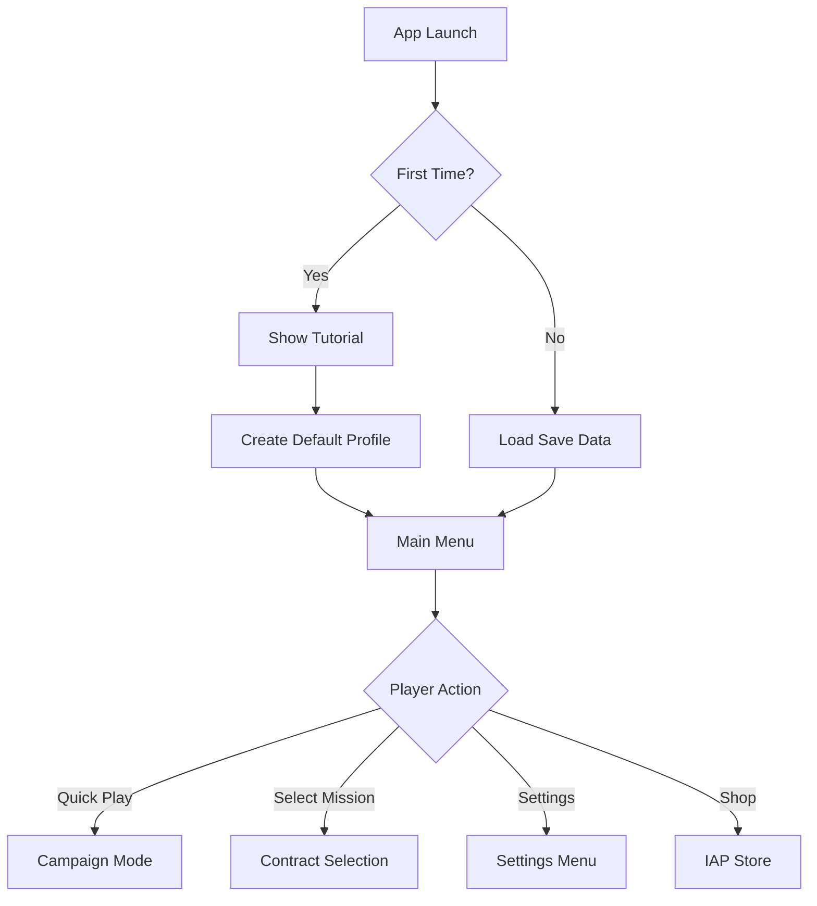

# Thermal Hunt - Game Workflows & System Logic

This document provides comprehensive documentation of all game workflows, system interactions, and logic flows in Thermal Hunt.

---

## Table of Contents

1. [Player Journey Workflow](#player-journey-workflow)
2. [Game State Machine](#game-state-machine)
3. [Mission Workflow](#mission-workflow)
4. [Combat & Ballistics Workflow](#combat--ballistics-workflow)
5. [AI Behavior Workflow](#ai-behavior-workflow)
6. [Thermal Vision Workflow](#thermal-vision-workflow)
7. [Progression & Unlocking Workflow](#progression--unlocking-workflow)
8. [Monetization Workflow](#monetization-workflow)
9. [Session Management Workflow](#session-management-workflow)
10. [Save/Load Workflow](#saveload-workflow)

---

## 1. Player Journey Workflow

### First Launch Experience



### Typical Play Session

```
1. Launch Game
   ↓
2. Load Save Data
   ↓
3. Main Menu
   ↓
4. Check Daily Challenges (Auto-shown if available)
   ↓
5. Select Play Mode:
   - Quick Play (2-3 chained contracts, 10-15 min)
   - Campaign Mode (pre-built campaign)
   - Custom Contract (single mission)
   ↓
6. Loadout Selection (if custom)
   - Choose Weapon
   - Choose Scope
   - Confirm Loadout
   ↓
7. Mission Briefing
   - View objectives
   - View rewards
   - Start Mission
   ↓
8. Gameplay (In Mission)
   - Hunt rats using thermal scope
   - Manage battery life
   - Track objectives
   ↓
9. Mission End
   - Success: Show results, star rating, rewards
   - Failure: Show stats, retry option
   ↓
10. Next Action:
    - Next mission in campaign (if campaign mode)
    - Return to menu
    - Retry mission
    ↓
11. Session Summary (after 10-15 min or player quits)
    - Total stats
    - Session rewards
    - Daily challenge progress
    - Streak bonuses
    ↓
12. Save Progress
    ↓
13. Exit or Continue
```

---

## 2. Game State Machine

### State Diagram

```
┌─────────────┐
│  MainMenu   │ ◄────────────────────┐
└──────┬──────┘                      │
       │                             │
       ├─────► ContractSelection     │
       │            │                │
       ├─────► LoadoutSetup          │
       │            │                │
       └─────► MissionBriefing       │
                    │                │
              ┌─────▼─────┐          │
              │ InMission │          │
              └─────┬─────┘          │
                    │                │
       ┌────────────┼────────────┐   │
       │            │            │   │
┌──────▼──────┐     │     ┌─────▼────────┐
│MissionComplete│    │     │MissionFailed │
└──────┬────────┘   │     └─────┬────────┘
       │            │            │
       └────────────┴────────────┘
                    │
              ┌─────▼─────┐
              │   Paused  │
              └───────────┘
```

### State Transitions

| From State | To State | Trigger | Conditions |
|------------|----------|---------|------------|
| MainMenu | ContractSelection | Player clicks "Play" | None |
| ContractSelection | LoadoutSetup | Contract selected | Contract unlocked |
| LoadoutSetup | MissionBriefing | Loadout confirmed | Valid loadout |
| MissionBriefing | InMission | Player clicks "Start" | All systems ready |
| InMission | Paused | ESC/Pause button | Anytime |
| InMission | MissionComplete | All objectives done | Time remaining > 0 |
| InMission | MissionFailed | Time expired OR quit | Objectives incomplete |
| Paused | InMission | Resume clicked | None |
| Paused | MainMenu | Quit clicked | Progress lost warning |
| MissionComplete | MainMenu | Continue clicked | Rewards claimed |
| MissionComplete | Next Mission | Next clicked | Campaign mode |
| MissionFailed | MainMenu | Return clicked | Stats saved |
| MissionFailed | InMission | Retry clicked | Ammo restored |

---

## 3. Mission Workflow

### Mission Lifecycle

```
┌──────────────────────────────────────────────────┐
│ MISSION INITIALIZATION                           │
└──────────────────────────────────────────────────┘
1. Load Contract Data
   - Target count (number of rats to eliminate)
   - Time limit (seconds)
   - Ammunition allowed
   - Star rating thresholds

2. Setup Environment
   - Generate procedural environment (50x50m farm)
   - Create buildings (3 random sizes)
   - Spawn props (20 barrels/crates)
   - Bake NavMesh for AI pathfinding

3. Spawn Enemies
   - Spawn specified number of rats
   - Randomize rat types (Drone, Alpha, NestMother)
   - Randomize rat sizes (Small, Medium, Large)
   - Set initial AI states (Idle, Feeding, Patrolling)

4. Initialize Player
   - Set player position (spawn point)
   - Equip selected weapon
   - Attach selected scope
   - Initialize thermal vision
   - Set battery level (based on upgrade level)
   - Load ammunition count

5. Start HUD
   - Show ammo counter
   - Show target counter (0 / X killed)
   - Show mission timer (countdown)
   - Show battery indicator
   - Show score

┌──────────────────────────────────────────────────┐
│ MISSION GAMEPLAY LOOP                            │
└──────────────────────────────────────────────────┘
EVERY FRAME:
1. Process Player Input
   - Mouse/touch look (camera rotation)
   - Movement input (if enabled)
   - Fire button (shoot)
   - Aim down sights (scope zoom)
   - Hold breath (stabilization)

2. Update Thermal Vision
   - Render thermal effect to render texture
   - Apply heat signatures to all objects
   - Drain battery based on:
     * Base drain rate
     * Upgrade level efficiency
     * Power saving mode (50% reduction if active)
   - Check battery warnings:
     * 60 seconds: Low battery warning
     * 30 seconds: Critical warning
     * 0 seconds: Thermal disabled

3. Update AI Systems
   - For each rat:
     * Update state machine
     * Process sensory input (vision, hearing)
     * Execute behavior (idle, patrol, flee, etc.)
     * Update NavMesh pathfinding
     * Apply LOD (reduce update frequency if far)

4. Check Mission Objectives
   - Count eliminated rats
   - Update HUD target counter
   - Check win condition: targets killed >= target count
   - Update mission timer (countdown)
   - Check fail condition: time <= 0 and objectives incomplete

5. Update Score
   - Base score per kill
   - Headshot bonus (50%)
   - Combo multiplier (consecutive kills)
   - Accuracy bonus
   - Time bonus

6. Update UI
   - Ammo: color code (green > 30%, yellow 10-30%, red < 10%)
   - Timer: color code (green > 50%, yellow 25-50%, red < 25%)
   - Score: real-time update
   - Battery: visual bar + percentage

┌──────────────────────────────────────────────────┐
│ MISSION COMPLETION                               │
└──────────────────────────────────────────────────┘
ON WIN:
1. Stop mission timer
2. Calculate final score:
   - Base: (kills × weapon.baseScore)
   - Headshots: (headshots × weapon.headshotBonus)
   - Accuracy: (accuracy × 100)
   - Time bonus: (timeRemaining × 10)

3. Calculate star rating:
   - 1 Star: score >= oneStarThreshold
   - 2 Stars: score >= twoStarThreshold
   - 3 Stars: score >= threeStarThreshold

4. Award rewards:
   - Experience points (based on score)
   - Currency (based on performance)
   - Unlock progress (if first completion)

5. Update statistics:
   - Total kills
   - Total shots fired
   - Total accuracy
   - Missions completed
   - Best time for this contract

6. Update daily challenges:
   - Check kill count challenges
   - Check contract completion challenges
   - Check headshot challenges
   - Check accuracy challenges

7. Save progress

8. Show mission complete screen:
   - Star rating (animated)
   - Score breakdown
   - Rewards earned
   - Statistics
   - Next mission button (if campaign)
   - Return to menu button

ON FAIL:
1. Stop mission timer
2. Show stats:
   - Rats eliminated / target count
   - Accuracy
   - Time taken

3. Save partial progress:
   - Update total shots/kills (even if failed)

4. Show mission failed screen:
   - Failure reason (time expired / quit)
   - Stats
   - Retry button
   - Return to menu button
```

---

## 4. Combat & Ballistics Workflow

### Shooting Sequence

```
┌──────────────────────────────────────────────────┐
│ PLAYER FIRES WEAPON                              │
└──────────────────────────────────────────────────┘
1. Input Detection
   - Left mouse click / touch fire zone
   - Check: Ammo > 0?
   - Check: Can fire? (fire rate cooldown)

2. Pre-Fire Checks
   IF ammo == 0:
      - Play dry fire sound
      - Show "Out of Ammo" UI message
      - STOP

   IF on cooldown:
      - Ignore input
      - STOP

3. Fire Weapon (BallisticsController)
   - Decrement ammo count
   - Increment shots fired stat
   - Start fire rate cooldown

4. Calculate Shot Trajectory
   - Start point: Camera center
   - Direction: Camera forward
   - Apply accuracy modifier:
     * Base accuracy: weapon.accuracy
     * Scoped modifier: +50% accuracy
     * Holding breath: +30% accuracy
     * Random spread: ±(1 - accuracy) degrees

5. Raycast Bullet Path
   - Cast ray from start point in direction
   - Max distance: weapon.maxRange
   - Layer mask: Target | Environment
   - Ignore: Player layer

6. Process Hit Result

   IF HIT NOTHING:
      - Play weapon sound (modified by weapon.soundLevel)
      - Play muzzle flash particle effect
      - Create bullet tracer effect
      - Alert nearby rats (sound propagation)
      - DONE

   IF HIT ENVIRONMENT:
      - Play weapon sound
      - Play muzzle flash
      - Create bullet tracer to hit point
      - Create impact effect:
        * Wood impact: dust particles
        * Metal impact: sparks (60% chance) + ricochet sound (30%)
        * Concrete impact: dust + chips
      - Alert nearby rats (louder due to impact)
      - DONE

   IF HIT RAT:
      - Increment shots hit stat
      - Play weapon sound
      - Play muzzle flash
      - Create bullet tracer to hit point
      - Create blood splatter effect
      - Create blood heat signature (thermal effect)
      - Check if headshot:
        * Raycast hit rat's head collider?
        * YES: Increment headshots stat
        * Apply damage × 2.0
      - Calculate damage:
        * Base: weapon.damage
        * Headshot: × 2.0
        * Weak point: + 50%
        * Range falloff: × (1 - distance/maxRange)
      - Apply damage to rat AI
      - Rat takes damage:
        * health -= damage
        * IF health <= 0:
          - Rat dies
          - Trigger death animation
          - Trigger cooling effect (heat signature fades over 5s)
          - Award score (weapon.baseScore + headshot bonus)
          - Increment kills counter
          - Fire TargetKilledEvent
          - Check mission objectives
        * ELSE:
          - Rat enters "Alerted" or "Fleeing" state
      - Alert nearby rats (very loud)
      - DONE

7. Apply Recoil
   - Apply camera kick:
     * Upward: weapon.recoilAmount × 0.8
     * Random horizontal: weapon.recoilAmount × 0.3
   - Apply over 0.1 seconds
   - Return to center over 0.2 seconds

8. Trigger Effects
   - Shell ejection particle (from weapon)
   - Screen shake (subtle)
   - Haptic feedback (mobile only)

9. Fire Events
   - EventBus.Publish(WeaponFiredEvent)
   - EventBus.Publish(TargetHitEvent) [if hit rat]
   - EventBus.Publish(TargetKilledEvent) [if killed rat]
```

### Ballistics Calculation Details

```csharp
// Pseudo-code for ballistics system

// 1. Calculate base trajectory
Vector3 direction = camera.forward;
Vector3 origin = camera.position;

// 2. Apply weapon spread
float spread = (1f - weaponAccuracy) * maxSpreadAngle;
if (isScoped) spread *= 0.5f;
if (isHoldingBreath) spread *= 0.7f;

direction = AddSpread(direction, spread);

// 3. Calculate bullet drop
float bulletTime = distance / muzzleVelocity;
float drop = 0.5f * Physics.gravity.y * bulletTime * bulletTime;
direction.y += drop / distance;

// 4. Perform raycast
RaycastHit hit;
if (Physics.Raycast(origin, direction, out hit, maxRange, hitLayerMask))
{
    // Process hit
}

// 5. Calculate damage with falloff
float damageMultiplier = 1f - (hit.distance / maxRange);
float finalDamage = baseDamage * damageMultiplier;

// 6. Apply headshot multiplier
if (IsHeadshot(hit))
{
    finalDamage *= 2.0f;
}
```

---

## 5. AI Behavior Workflow

### Rat AI State Machine

```
┌──────────────────────────────────────────────────┐
│ RAT AI STATE MACHINE (7 STATES)                  │
└──────────────────────────────────────────────────┘

STATE: IDLE
├─ Behavior:
│  - Stand still
│  - Look around randomly (head rotation)
│  - Occasionally sniff (animation)
├─ Duration: 3-8 seconds (random)
├─ Transitions:
│  ├─ → FEEDING (30% chance after duration)
│  ├─ → PATROLLING (50% chance after duration)
│  ├─ → INVESTIGATING (if hears sound nearby)
│  ├─ → ALERTED (if detects danger)
│  └─ → FLEEING (if very loud sound or visual threat)

STATE: FEEDING
├─ Behavior:
│  - Head down (vulnerable)
│  - Play eating animation
│  - Stationary
│  - Reduced detection range (distracted)
├─ Duration: 5-10 seconds
├─ Transitions:
│  ├─ → IDLE (after duration)
│  ├─ → INVESTIGATING (if hears sound)
│  ├─ → ALERTED (if detects danger)
│  └─ → FLEEING (if loud sound)

STATE: PATROLLING
├─ Behavior:
│  - Walk slowly around home point
│  - NavMesh pathfinding
│  - Check path waypoints
│  - Normal detection range
├─ Duration: 8-15 seconds
├─ Patrol pattern: Random waypoints within 5m of home
├─ Transitions:
│  ├─ → IDLE (after patrol complete)
│  ├─ → INVESTIGATING (if hears sound)
│  ├─ → ALERTED (if detects danger)
│  └─ → FLEEING (if threatened)

STATE: INVESTIGATING
├─ Behavior:
│  - Move toward sound source
│  - Cautious movement
│  - Heightened senses (+50% detection range)
│  - Pause frequently to look/listen
├─ Duration: 3-6 seconds or until reach sound location
├─ Transitions:
│  ├─ → IDLE (nothing found)
│  ├─ → ALERTED (if discovers threat)
│  └─ → FLEEING (if loud sound during investigation)

STATE: ALERTED
├─ Behavior:
│  - Freeze in place
│  - Look toward threat direction
│  - Body tensed (animation)
│  - Emit alert vocalization (warns nearby rats)
│  - Maximum detection range
├─ Duration: 1-3 seconds
├─ Alert radius: 8 meters (other rats within range also alert)
├─ Transitions:
│  ├─ → FLEEING (high danger level or visual confirmation)
│  ├─ → INVESTIGATING (moderate danger, no visual)
│  └─ → IDLE (false alarm after 3 seconds)

STATE: FLEEING
├─ Behavior:
│  - Run at maximum speed
│  - Find nearest cover point (NavMesh)
│  - Pathfind to safety
│  - Emit distress vocalization
│  - Alert all nearby rats (chain reaction)
├─ Duration: Until reach cover or 5 seconds
├─ Speed multiplier: 2.5× base speed
├─ Transitions:
│  ├─ → HIDDEN (reach cover point)
│  └─ → ALERTED (can't find cover, reassess)

STATE: HIDDEN
├─ Behavior:
│  - In unreachable spot (wall crack, pipe, rubble)
│  - Cannot be shot (invulnerable)
│  - Occasionally peek out
│  - Slowly calm down (timer)
├─ Duration: 10-20 seconds
├─ Exit conditions:
│  - No player activity nearby for 10+ seconds
│  - Random chance to exit every 5 seconds
├─ Transitions:
│  ├─ → PATROLLING (if safe)
│  ├─ → IDLE (if safe)
│  └─ → FLEEING (if player detected during peek)
```

### Detection System

```
┌──────────────────────────────────────────────────┐
│ RAT SENSORY SYSTEM                               │
└──────────────────────────────────────────────────┘

HEARING (Sound-Based Detection):
├─ Range: 8 meters (configurable per rat type)
├─ Sound events:
│  ├─ Weapon fire: soundLevel × 8m range
│  ├─ Bullet impact: 5m range
│  ├─ Player footsteps: 2m range (if running)
│  └─ Other rats alert calls: 8m range
├─ Response:
│  ├─ Loud sound (weapon fire): Immediate FLEEING
│  ├─ Medium sound (impact): INVESTIGATING
│  └─ Quiet sound (footsteps): ALERTED

VISION (Line-of-Sight Detection):
├─ Detection cone: 120 degrees field of view
├─ Range:
│  ├─ IDLE: 5 meters
│  ├─ FEEDING: 3 meters (distracted)
│  ├─ PATROLLING: 6 meters
│  ├─ INVESTIGATING: 7.5 meters (+50%)
│  └─ ALERTED: 10 meters (maximum)
├─ Raycast to player:
│  ├─ Check angle: dot product with forward vector
│  ├─ Check distance: magnitude <= range
│  ├─ Check obstruction: raycast to player (no obstacles?)
│  └─ Visual confirmation: player in direct line of sight
├─ Response:
│  ├─ Clear visual: FLEEING or ALERTED
│  └─ Partial visual: INVESTIGATING

THREAT ASSESSMENT:
├─ Threat level (0-100):
│  ├─ Visual confirmation: +50
│  ├─ Loud sound: +40
│  ├─ Medium sound: +20
│  ├─ Nearby rat death: +60
│  ├─ Alert call from other rat: +30
│  └─ Decays over time: -10 per second
├─ State based on threat:
│  ├─ 0-20: IDLE or PATROLLING
│  ├─ 21-50: INVESTIGATING or ALERTED
│  └─ 51-100: FLEEING or HIDDEN
```

### Group Behavior

```
ALERT PROPAGATION:
When rat enters ALERTED or FLEEING state:
1. Find all rats within 8 meter radius
2. For each nearby rat:
   - Increase their threat level by 30
   - If their threat > 50:
     * They also enter FLEEING
     * Chain reaction continues (cascading alerts)
   - Play alert vocalization
3. Creates realistic group panic behavior

EXAMPLE SCENARIO:
Player fires weapon at Rat A:
├─ Rat A: Instant death
├─ Rats B, C, D (within 8m):
│  ├─ Hear loud weapon sound: +40 threat
│  ├─ Detect nearby death: +60 threat
│  └─ Total: 100 threat → FLEEING
├─ Rats E, F (10-15m away):
│  ├─ Hear weapon sound (faint): +20 threat
│  └─ See others fleeing: +30 threat → ALERTED
└─ Rats G, H (20m+ away):
   └─ No detection (too far)
```

---

## 6. Thermal Vision Workflow

### Thermal Rendering Pipeline

```
┌──────────────────────────────────────────────────┐
│ THERMAL VISION SYSTEM                            │
└──────────────────────────────────────────────────┘

INITIALIZATION:
1. Create separate camera for thermal rendering
   - Copy main camera transform
   - Set culling mask: ThermalVisible layer only

2. Create render texture
   - Mobile: 512×512 resolution
   - PC: 1024×1024 resolution
   - Format: ARGB32
   - No MSAA, no HDR (performance)

3. Assign thermal shader to material
   - Load ThermalVision.shader
   - Create material instance
   - Set initial parameters

EVERY FRAME WHEN THERMAL ACTIVE:
1. Update heat signatures for all objects:

   FOR EACH ThermalVisible object:
   ├─ Calculate heat intensity:
   │  ├─ Mammal (living rat):
   │  │  ├─ Base: 0.7-0.9 (warm-blooded)
   │  │  ├─ Breathing modifier: sin(time × breathRate) × 0.1
   │  │  ├─ Movement bonus: velocity.magnitude × 0.05
   │  │  └─ Final: clamp(base + breathing + movement, 0, 1)
   │  │
   │  ├─ Environment (terrain, props):
   │  │  └─ Fixed: 0.1-0.2 (cold)
   │  │
   │  ├─ Metal (weapons, machinery):
   │  │  └─ Fixed: 0.3 (slightly warm)
   │  │
   │  └─ Dead rat:
   │     └─ Cooling: start at 0.8, decay to 0.2 over 5 seconds
   │
   ├─ Map heat intensity to gradient color:
   │  ├─ 0.0-0.2: Dark blue/purple (cold)
   │  ├─ 0.2-0.4: Blue (cool)
   │  ├─ 0.4-0.6: Green/yellow (warm)
   │  ├─ 0.6-0.8: Orange (hot)
   │  └─ 0.8-1.0: White/yellow (very hot)
   │
   └─ Apply to material using MaterialPropertyBlock:
      - _HeatIntensity: float
      - _HeatGradient: Texture2D gradient
      - Performance: no material instantiation!

2. Render thermal camera to texture:
   - Camera renders ThermalVisible layer
   - Outputs to thermal render texture

3. Apply post-processing shader:
   - Input: thermal render texture
   - Effects:
     ├─ Noise/grain: Perlin noise overlay (intensity: 0.15)
     ├─ Scan lines: horizontal lines (spacing: 4 pixels)
     ├─ Vignette: darken edges (intensity: 0.3)
     ├─ Chromatic aberration: RGB split (subtle)
     └─ Low battery flicker: if battery < 10%
   - Output: final thermal image

4. Display thermal image:
   - IF scoped (zoomed):
     ├─ Full screen thermal overlay
     ├─ Add scope reticle/crosshair
     └─ Add scope mask (circular vignette)
   - ELSE:
     ├─ No thermal display (scope not active)
     └─ Normal vision

5. Update battery:
   - Drain rate calculation:
     ├─ Base drain: 1.0 / maxBatteryTime
     ├─ Efficiency: upgradeLevel efficiency multiplier
     ├─ Power saving: × 0.5 if power save mode active
     └─ Final drain: base × efficiency × powerSave

   - Battery -= drainRate × deltaTime

   - Check warnings:
     ├─ IF battery <= 60s and not warned:
     │  ├─ Show "Low Battery" UI warning
     │  ├─ Play warning sound
     │  └─ Set warned flag
     │
     ├─ IF battery <= 30s and not critical warned:
     │  ├─ Show "Critical Battery" UI (red)
     │  ├─ Play critical sound
     │  ├─ Start flicker effect
     │  └─ Set critical warned flag
     │
     └─ IF battery <= 0:
        ├─ Disable thermal vision
        ├─ Show "Battery Depleted" message
        └─ Offer quick recharge or watch ad
```

### Battery Management

```
BATTERY UPGRADE SYSTEM:
Level 0: 300s (5 min)  | Drain: 100% | Cost: Default
Level 1: 420s (7 min)  | Drain: 90%  | Cost: 1000 currency
Level 2: 540s (9 min)  | Drain: 80%  | Cost: 2500 currency
Level 3: 660s (11 min) | Drain: 70%  | Cost: 5000 currency
Level 4: 900s (15 min) | Drain: 60%  | Cost: 10000 currency

QUICK RECHARGE:
├─ Charges: 2 per mission
├─ Recharge amount: 60 seconds
├─ Cooldown: 30 seconds between uses
├─ Usage:
│  ├─ Player presses recharge button
│  ├─ Check: charges remaining > 0?
│  ├─ Check: cooldown elapsed?
│  ├─ Add 60 seconds to battery
│  ├─ Decrement charges
│  └─ Start cooldown timer

POWER SAVING MODE:
├─ Activation:
│  ├─ Manual: player toggles in HUD
│  └─ Auto: activates at 25% battery
├─ Effect: 50% slower drain rate
├─ Visual indicator: "Power Save" icon in HUD
├─ Trade-off: Slightly reduced thermal quality (optional)

AD RECHARGE (Monetization):
├─ Trigger: Battery depleted mid-mission
├─ Offer: "Watch ad for full recharge?"
├─ If accepted:
│  ├─ Pause game
│  ├─ Play rewarded video ad
│  ├─ On ad complete:
│  │  ├─ Fully recharge battery
│  │  ├─ Resume game
│  │  └─ Track ad view (analytics)
│  └─ On ad failed/skipped:
│     └─ No recharge (continue with depleted battery)
```

---

## 7. Progression & Unlocking Workflow

### Player Leveling System

```
EXPERIENCE SYSTEM:
├─ XP Sources:
│  ├─ Contract completion: 100-500 XP (based on difficulty)
│  ├─ Rat kills: 10 XP each
│  ├─ Headshots: +5 bonus XP
│  ├─ Perfect mission (3 stars): +100 bonus XP
│  ├─ Daily challenge completion: 50-200 XP
│  ├─ First win of day: +500 XP
│  ├─ Session rewards: 100-500 XP (based on playtime)
│  └─ Streak bonuses: +100 XP per consecutive day
│
├─ XP to Level Formula:
│  └─ XP required = 100 × (level^1.5)
│     Examples:
│     - Level 1 → 2: 100 XP
│     - Level 5 → 6: 559 XP
│     - Level 10 → 11: 1581 XP
│     - Level 20 → 21: 4472 XP
│
└─ Level Up Rewards:
   ├─ Every level: 500 currency
   ├─ Level 5: Unlock "Ranger Rifle"
   ├─ Level 10: Unlock "Advanced Thermal Scope"
   ├─ Level 15: Unlock "Silenced Sniper"
   ├─ Level 20: Unlock "Pro Thermal Scope"
   ├─ Level 25: Unlock "Campaign: Industrial Crisis"
   ├─ Level 30: Unlock "Expert Contracts"
   └─ Level 50: Maximum level (prestige option)

CURRENCY SYSTEM:
├─ Currency Sources:
│  ├─ Contract completion: 100-1000 (based on score)
│  ├─ Star rating bonus: 500 per star
│  ├─ Daily challenges: 200-500
│  ├─ Session rewards: 200-1000
│  ├─ Level up: 500
│  └─ IAP purchases: various amounts
│
└─ Currency Spending:
   ├─ Weapon unlocks: 1000-5000
   ├─ Scope unlocks: 1500-7500
   ├─ Battery upgrades: 1000-10000
   ├─ Quick recharge packs: 500 (5 charges)
   ├─ Contract unlocks: 2000-5000
   └─ Cosmetic items: 500-2000 (future)

UNLOCK PROGRESSION TREE:
Starting gear (Level 1):
└─ Basic Rifle (free)
   └─ Basic Thermal Scope (free)
      └─ First 3 contracts (free)

Level 5 unlocks:
└─ Ranger Rifle (1000 currency)
   └─ Improved accuracy, faster fire rate

Level 10 unlocks:
└─ Advanced Thermal Scope (2500 currency)
   ├─ Better thermal quality
   └─ Larger field of view

Level 15 unlocks:
└─ Silenced Sniper (3500 currency)
   ├─ Near-silent shots (less AI alerting)
   ├─ High damage
   └─ Slower fire rate

Level 20 unlocks:
└─ Pro Thermal Scope (5000 currency)
   ├─ Highest thermal quality
   ├─ Faster battery efficiency
   └─ Target tracking assist

Premium IAP unlocks (any level):
└─ Elite Package ($9.99)
   ├─ All weapons unlocked
   ├─ All scopes unlocked
   ├─ 10,000 currency
   └─ Remove ads permanently
```

### Star Rating System

```
STAR CALCULATION PER CONTRACT:

Score Formula:
├─ Base score = kills × weapon.baseScore
├─ Headshot bonus = headshots × weapon.headshotBonus
├─ Accuracy bonus = (shotsHit / shotsFired) × 100
└─ Time bonus = timeRemaining × 10

Total Score = base + headshot + accuracy + time

Star Thresholds (defined per contract):
├─ 1 Star: score >= oneStarThreshold (e.g., 500)
│  └─ Unlocks: Next contract
├─ 2 Stars: score >= twoStarThreshold (e.g., 800)
│  └─ Unlocks: Replay rewards
└─ 3 Stars: score >= threeStarThreshold (e.g., 1200)
   └─ Unlocks: Perfect bonus XP + currency

EXAMPLE (Barn Basics contract):
Target: 8 rats, 4 minute limit, 12 rounds

Scenario A (1 star):
├─ 8 kills, 2 headshots, 12 shots fired (66% accuracy)
├─ 1:30 remaining (90 seconds)
├─ Score = (8×50) + (2×25) + 66 + (90×10) = 400 + 50 + 66 + 900 = 1416
└─ Result: ⭐⭐⭐ (3 stars!)

Scenario B (2 stars):
├─ 8 kills, 0 headshots, 10 shots fired (80% accuracy)
├─ 0:10 remaining (10 seconds)
├─ Score = (8×50) + 0 + 80 + (10×10) = 400 + 80 + 100 = 580
└─ Result: ⭐⭐ (2 stars)

Scenario C (1 star):
├─ 8 kills, 0 headshots, 12 shots fired (66% accuracy)
├─ 0:01 remaining (1 second)
├─ Score = (8×50) + 0 + 66 + (1×10) = 400 + 66 + 10 = 476
└─ Result: ⭐ (1 star, just barely!)
```

---

## 8. Monetization Workflow

### Ad System Integration

```
AD TYPES:

1. REWARDED VIDEO ADS
   ├─ Trigger points:
   │  ├─ Battery depleted mid-mission
   │  ├─ Out of ammo (mission active)
   │  ├─ Quick recharge charges depleted
   │  └─ Manual "Watch ad for reward" button
   │
   ├─ Rewards:
   │  ├─ Full battery recharge
   │  ├─ +6 rounds ammunition
   │  ├─ +5 quick recharge charges
   │  └─ +500 currency
   │
   └─ Flow:
      1. Player triggers ad opportunity
      2. Show dialog: "Watch ad for [reward]?"
      3. If accepted:
         ├─ Pause game
         ├─ Call AdManager.ShowRewardedAd(adType)
         ├─ Wait for ad completion callback
         ├─ On success:
         │  ├─ Grant reward
         │  ├─ Resume game
         │  └─ Track event: analytics.LogAdView()
         └─ On failure/skip:
            └─ Resume game, no reward

2. INTERSTITIAL ADS
   ├─ Trigger frequency:
   │  ├─ Every 3 completed missions (configurable)
   │  ├─ After returning to main menu
   │  └─ Never during active gameplay
   │
   ├─ Flow:
   │  1. Mission complete screen shown
   │  2. Player clicks "Continue"
   │  3. Check: missionsSinceLastAd >= 3?
   │  4. If yes:
   │     ├─ Call AdManager.ShowInterstitialAd()
   │     ├─ Show "Loading..." briefly
   │     ├─ Display interstitial ad
   │     ├─ After ad: return to menu
   │     └─ Reset counter
   │  5. If no:
   │     └─ Go directly to menu
   │
   └─ Frequency capping:
      ├─ Minimum 3 minutes between interstitials
      └─ Maximum 1 interstitial per 15-minute session

3. BANNER ADS (Optional)
   ├─ Placement: Bottom of main menu only
   ├─ Never shown during gameplay
   └─ Removed if player purchases "Remove Ads" IAP

AD FREQUENCY MANAGEMENT:
├─ Track last ad timestamp
├─ Track ads shown per session
├─ Limits:
│  ├─ Rewarded: Unlimited (player-initiated)
│  ├─ Interstitial: Max 3 per session
│  └─ Banner: Continuous (menu only)
```

### In-App Purchase System

```
IAP PRODUCTS:

1. REMOVE ADS ($4.99)
   ├─ Product ID: "com.thermalhunt.removeads"
   ├─ Benefits:
   │  ├─ Disable all interstitial ads
   │  ├─ Disable all banner ads
   │  └─ Keep rewarded ads (player benefit)
   └─ Implementation:
      - Save "adsRemoved" flag in SaveData
      - Check flag before showing ads
      - Persist across sessions

2. STARTER PACK ($9.99)
   ├─ Product ID: "com.thermalhunt.starterpack"
   ├─ Contents:
   │  ├─ Unlock Ranger Rifle (worth 1000)
   │  ├─ Unlock Advanced Scope (worth 2500)
   │  ├─ 5000 currency
   │  ├─ Battery Level 2 upgrade (worth 2500)
   │  └─ 20 quick recharge charges
   └─ Value: $25 worth for $9.99 (60% savings)

3. CURRENCY PACKS
   ├─ Small Pack ($1.99): 1,500 currency
   ├─ Medium Pack ($4.99): 4,000 currency
   ├─ Large Pack ($9.99): 10,000 currency
   └─ Mega Pack ($19.99): 25,000 currency

4. PREMIUM WEAPONS BUNDLE ($6.99)
   ├─ Product ID: "com.thermalhunt.premiumweapons"
   ├─ Unlocks:
   │  ├─ Silenced Sniper
   │  ├─ Pro Thermal Scope
   │  └─ Exclusive weapon skin (future)

5. BATTERY UPGRADE PACK ($2.99)
   ├─ Product ID: "com.thermalhunt.batterypack"
   ├─ Benefits:
   │  ├─ Instant max battery upgrade (Level 4)
   │  └─ 10 quick recharge charges

IAP FLOW:
1. Player navigates to Shop/Store
2. Display available IAPs with:
   ├─ Product name
   ├─ Description
   ├─ Price (localized)
   └─ "Buy" button
3. Player clicks "Buy"
4. Call IAPManager.PurchaseProduct(productID)
5. Unity IAP processes payment:
   ├─ Platform store handles transaction
   ├─ On success callback:
   │  ├─ Grant purchased items
   │  ├─ Save receipt for restoration
   │  ├─ Update UI
   │  ├─ Show "Purchase successful!" message
   │  └─ Track purchase: analytics.LogPurchase()
   └─ On failure callback:
      ├─ Show error message
      └─ Log failure reason
6. Purchase restoration:
   ├─ "Restore Purchases" button in settings
   ├─ Queries platform store for receipts
   └─ Re-grants non-consumable purchases

MONETIZATION BEST PRACTICES:
├─ Never force ads during gameplay
├─ Always offer free alternative (grind currency)
├─ Price IAPs competitively
├─ Provide meaningful rewards for ads
├─ Respect "Remove Ads" purchase
└─ Test purchase flow thoroughly
```

---

## 9. Session Management Workflow

### Session Lifecycle

```
SESSION START:
1. App launched or resumed
2. SessionManager initializes:
   ├─ Record session start time
   ├─ Load last session data
   ├─ Check daily reset:
   │  ├─ Last played date ≠ today?
   │  ├─ If yes:
   │  │  ├─ Generate new daily challenges
   │  │  ├─ Increment streak (if yesterday) or reset
   │  │  ├─ Reset first-win bonus
   │  │  └─ Log daily login event
   │  └─ If no: continue
   └─ Initialize tracking:
      - missions completed this session = 0
      - kills this session = 0
      - shots fired = 0
      - perfect missions = 0

DURING SESSION:
├─ Track all gameplay events:
│  ├─ Mission started
│  ├─ Mission completed
│  ├─ Kills, shots, headshots
│  ├─ Score earned
│  └─ Time played
│
├─ Update daily challenges progress:
│  - After each mission
│  - Real-time progress tracking
│
├─ Check session milestones:
│  ├─ 5 minutes played:
│  │  └─ Award 100 XP + 200 currency
│  ├─ 10 minutes played:
│  │  └─ Award 250 XP + 500 currency
│  ├─ 15 minutes played:
│  │  └─ Award 500 XP + 1000 currency
│  │  └─ Show "Take a break?" suggestion
│  └─ 30 minutes played:
│     └─ Show "Great session!" + summary
│
└─ Save progress periodically:
   - Auto-save every 2 minutes
   - Save after each mission
   - Save on app pause/background

SESSION END:
1. Calculate session statistics:
   ├─ Total playtime
   ├─ Missions completed
   ├─ Total kills
   ├─ Average accuracy
   ├─ Perfect missions count
   └─ Headshot ratio

2. Calculate session quality score (0-100):
   ├─ Missions completed: 30 points (6 points each, max 5)
   ├─ Perfect missions: 25 points (mission_perfect / total × 25)
   ├─ Accuracy: 25 points (accuracy × 25)
   └─ Headshot ratio: 20 points (headshot_ratio × 20)

3. Award session completion bonuses:
   ├─ First session of day: +500 XP
   ├─ Quality score >= 80: +300 XP
   ├─ Perfect session (all missions 3-star): +750 XP
   └─ Completed campaign: campaign bonus

4. Show session summary screen:
   ├─ Playtime
   ├─ Missions completed
   ├─ Total kills
   ├─ Session quality score
   ├─ XP earned
   ├─ Currency earned
   ├─ Daily challenges progress
   ├─ Streak status
   └─ "Play again" / "Quit" buttons

5. Final save:
   ├─ Save all session stats
   ├─ Update total playtime
   ├─ Update last played timestamp
   └─ Commit to disk

6. Analytics logging:
   ├─ Session duration
   ├─ Missions played
   ├─ Quality score
   ├─ Retention metrics
   └─ Monetization events
```

### Campaign Mode Workflow

```
CAMPAIGN MODE:

Campaign Structure:
├─ Campaign = 2-3 pre-selected contracts
├─ Total duration: 10-15 minutes
├─ Difficulty tiers: Rookie, Urban, Industrial

Pre-built Campaigns:
1. ROOKIE TRAINING (Easy, 10 min)
   ├─ Contract 1: Barn Basics (4 min, 8 rats)
   ├─ Contract 2: Garden Infestation (6 min, 10 rats)
   └─ Rewards: 300 XP, 600 currency

2. URBAN CLEANUP (Medium, 12 min)
   ├─ Contract 1: Warehouse Cleanup (5 min, 12 rats)
   ├─ Contract 2: Industrial Crisis (7 min, 15 rats)
   └─ Rewards: 500 XP, 1000 currency, unlock bonus

3. INDUSTRIAL CRISIS (Hard, 15 min)
   ├─ Contract 1: Industrial Crisis (7 min, 15 rats)
   ├─ Contract 2: Sewer System Crisis (8 min, 18 rats)
   └─ Rewards: 800 XP, 1500 currency, rare unlock

Campaign Flow:
1. Player selects campaign from menu
2. Show campaign overview:
   ├─ Total contracts
   ├─ Estimated time
   ├─ Potential rewards
   └─ Difficulty rating
3. Player confirms start
4. Execute campaign:
   ├─ Start first contract
   ├─ On contract complete:
   │  ├─ Show quick results (5 seconds)
   │  ├─ Auto-load next contract (no menu)
   │  ├─ Seamless transition
   │  └─ Battery/ammo carried over (if applicable)
   ├─ On contract failed:
   │  ├─ Show failure screen
   │  ├─ Options:
   │  │  ├─ Retry this contract
   │  │  ├─ Skip to next (partial rewards)
   │  │  └─ Quit campaign (partial rewards)
   │  └─ Track partial completion
   └─ On final contract complete:
      ├─ Show campaign complete screen
      ├─ Display full campaign stats
      ├─ Award bonus rewards:
      │  ├─ Campaign completion bonus: +300 XP
      │  ├─ Speed bonus (if under time): +200 XP
      │  ├─ Perfect campaign (all 3-star): +500 XP
      │  └─ Streak bonus: +100 XP per contract
      └─ Save campaign completion

Campaign Rewards Multiplier:
├─ Complete all contracts: ×1.5 rewards
├─ Complete within time limit: +20% rewards
├─ All contracts 3-star: +50% rewards
└─ No retries: +30% rewards
```

---

## 10. Save/Load Workflow

### Save System Architecture

```
SAVE DATA STRUCTURE:

PlayerData (JSON serialized):
{
  "playerLevel": int,              // Current level (1-50)
  "experience": int,                // Current XP progress
  "currency": int,                  // In-game currency balance

  "statistics": {
    "totalKills": int,
    "totalShots": int,
    "totalHeadshots": int,
    "missionsCompleted": int,
    "totalPlayTime": float,          // In seconds
    "accuracyRating": float          // Overall accuracy %
  },

  "progression": {
    "unlockedWeapons": [string],     // Array of weapon IDs
    "unlockedScopes": [string],      // Array of scope IDs
    "completedContracts": [string],  // Array of contract IDs
    "contractStars": {               // Dictionary<contractID, stars>
      "contract_barn_basics": 3,
      "contract_warehouse": 2
    },
    "unlockedCampaigns": [string]
  },

  "equipment": {
    "equippedWeapon": string,        // Current weapon ID
    "equippedScope": string,         // Current scope ID
    "batteryUpgradeLevel": int       // 0-4
  },

  "dailyChallenges": {
    "lastGeneratedDate": string,     // "2025-11-18"
    "currentChallenges": [
      {
        "challengeID": string,
        "challengeType": string,
        "targetValue": int,
        "currentProgress": int,
        "rewardXP": int,
        "rewardCurrency": int,
        "completed": bool
      }
    ],
    "streakDays": int,
    "lastPlayedDate": string
  },

  "settings": {
    "masterVolume": float,           // 0.0-1.0
    "sfxVolume": float,
    "musicVolume": float,
    "sensitivity": float,            // 0.1-2.0
    "adsRemoved": bool               // IAP purchase flag
  },

  "receipts": {                      // IAP receipts for restoration
    "removeAds": string,
    "starterPack": string,
    "premiumWeapons": string
  },

  "metadata": {
    "saveVersion": int,              // For migration
    "lastSaved": string,             // ISO 8601 timestamp
    "platform": string               // "iOS", "Android", "PC"
  }
}

SAVE TRIGGERS:

Automatic Saves:
├─ After mission complete/fail
├─ Every 2 minutes during gameplay
├─ When app enters background (mobile)
├─ On application quit
├─ After settings change
├─ After IAP purchase
└─ After unlock or progression event

Manual Save:
└─ Player can trigger save in settings (optional)

SAVE FLOW:

1. Collect all data:
   ├─ GameManager state
   ├─ SaveManager persistent data
   ├─ SessionManager session stats
   ├─ DailyChallengesSystem progress
   └─ Settings

2. Serialize to JSON:
   └─ Use JsonUtility or Newtonsoft.Json
      - Pretty print for readability (optional)
      - Compact for production

3. Write to multiple locations:
   ├─ PRIMARY: Application.persistentDataPath + "/save.json"
   ├─ BACKUP: PlayerPrefs (base64 encoded)
   └─ CLOUD (if available):
      ├─ iOS: iCloud
      ├─ Android: Google Play Games Services
      └─ Steam: Steam Cloud

4. Verify write:
   ├─ Check file exists
   ├─ Check file size > 0
   └─ If failed: retry up to 3 times

5. Log save event:
   └─ Analytics: "game_saved" event

LOAD FLOW:

1. Check save file existence:
   └─ Path: Application.persistentDataPath + "/save.json"

2. If exists:
   ├─ Read file contents
   ├─ Deserialize JSON:
   │  ├─ Try parse
   │  ├─ If failed: Try backup from PlayerPrefs
   │  └─ If both failed: Create new save
   │
   ├─ Validate save version:
   │  ├─ If current version: Load directly
   │  └─ If old version: Run migration script
   │
   └─ Apply data to game:
      ├─ Restore player level/XP
      ├─ Restore currency
      ├─ Restore unlocks
      ├─ Restore settings
      ├─ Restore daily challenges
      └─ Restore equipped items

3. If NOT exists (first launch):
   └─ Create default save:
      ├─ Level 1, 0 XP
      ├─ 500 starting currency
      ├─ Basic weapon/scope
      ├─ Default settings
      └─ Generate initial daily challenges

4. Post-load validation:
   ├─ Check for corrupted data
   ├─ Fix any invalid values
   └─ Save corrected data

CLOUD SYNC (Optional):

Upload to Cloud:
1. On save complete:
   ├─ Check cloud available?
   ├─ Compare local timestamp vs cloud timestamp
   └─ If local newer:
      ├─ Upload to cloud
      └─ Update cloud timestamp

Download from Cloud:
1. On game launch:
   ├─ Check cloud available?
   ├─ Fetch cloud save timestamp
   ├─ Compare with local timestamp
   └─ If cloud newer:
      ├─ Download cloud save
      ├─ Overwrite local save
      └─ Load cloud data

Conflict Resolution:
├─ If timestamps equal: Use local
├─ If unsure: Ask player which to keep
└─ Always backup before overwrite

SAVE MIGRATION:

Version Migration Script:
```csharp
// Pseudo-code
if (saveData.metadata.saveVersion < CURRENT_VERSION)
{
    switch (saveData.metadata.saveVersion)
    {
        case 1:
            // Migrate v1 → v2
            MigrateV1toV2(saveData);
            goto case 2;
        case 2:
            // Migrate v2 → v3
            MigrateV2toV3(saveData);
            break;
    }

    saveData.metadata.saveVersion = CURRENT_VERSION;
    SaveGame(saveData);
}
```

DATA INTEGRITY:

Checksum Validation (Anti-Cheat):
1. Calculate MD5 hash of save data
2. Store hash separately
3. On load:
   ├─ Recalculate hash
   ├─ Compare with stored hash
   └─ If mismatch:
      ├─ Save corrupted or tampered
      └─ Restore from backup or reset
```

---

## Summary

This document provides complete documentation of all game workflows and system logic in Thermal Hunt. Each workflow includes:

- Step-by-step process flows
- State transitions
- Event triggers
- Data structures
- Code examples
- Integration points

For implementation details, refer to the corresponding C# scripts in `Assets/_Game/Scripts/`.

---

**Version**: 1.0
**Date**: 2025-11-18
**Status**: Complete Production Documentation
